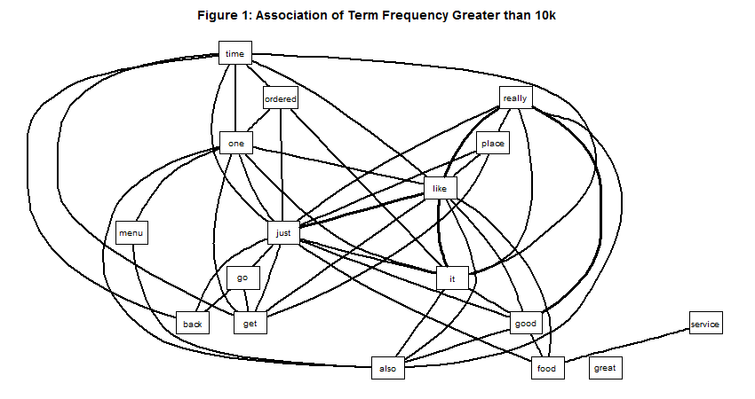
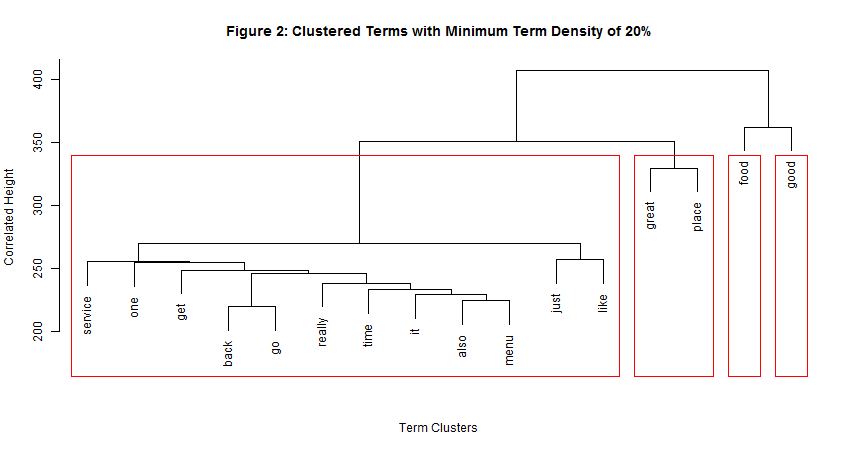
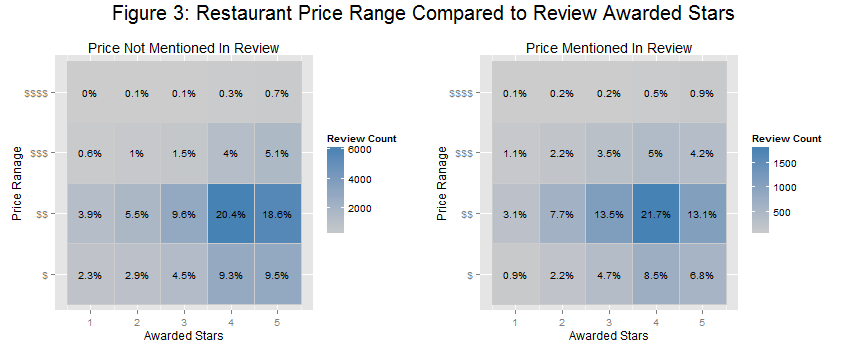

##Introduction

Restaurant menu pricing is not subjective; for the most part, it is very clear to guests what the price of any given food or beverage item is even before they visit a restaurant.  If that is truly the case, why do [Yelp](www.yelp.com) reviews contain references to pricing, rather than simply characterizing the quality of food, cleanliness of facilities, friendliness of service, etc.?  While these occurrences are anecdotally apparent, this analysis seeks to understand the extent to which the potentially 'value' laden reviews occur and to what degree they affect the overall average of awarded stars to the establishments.  Ultimately, it hypothesizes that the user authored reviews containing references to price are rated lower than those that do not.

##Methods and Data

In order conduct this analysis, the Yelp Dataset Challenge raw data files where used - more information regarding these files can be found here: [www.yelp.com/dataset_challenge](http://www.yelp.com/dataset_challenge).  These files were provided in a JSON format, with a single object in each line.  The preparation of the data into a usable state for the analysis was a three (3) step process:

1. **Load data and clean it:** All data and managed logic was conducted within the R ecosystem, version 3.2.2.  The files were deserialized and converted into nine (9) different R data frames using the `jsonlite` package.  However, only two (2) of these data frames are used in this analysis, *business* and *review*.  There are many cases of one-to-many relationships managed in a single file, e.g. two categories representing a single business.  These instances were reshaped to align any given entity with a single data frame.  To clean up various data elements, NULL values that may have resided in lists were converted to an `NA` value, date values were converted using the `lubridate` package, and any apparent enumerations were converted to factors.  Finally, all data was stored in the RData format for fast future loading.
2. **Isolate data frames of interest, subset them, and remove unused features:** For the purposes of this analysis, only businesses with a *category* of 'Restaurant' were used, and where a *category* of 'Fast Food' was not present.  Furthermore, the restaurants needed to be open for business, and they also needed to have a valid price range, e.g. 1 is the cheapest tier and 4 is the most expensive tier.  Lastly, in order to work with a manageable set of data, only restaurants located in Pittsburgh, PA were included in the analysis - this yields around forty (40) thousand reviews for analysis.
3. **Load reviews into a text mining and analytics package:** All of the reviews were loaded into a text mining corpus using the `tm` package. White-space, punctuation, and common stop-words were removed, e.g. 'a', 'an', 'the', etc.  The document terms were stemmed, meaning common word suffixes, such as 'ing' or 'ed', were removed. Additionally, many pattern replacements were conducted, primarily around the term 'price', e.g. change the term 'pricey' to 'price'.  Finally, a [Term Document Matrix](https://en.wikipedia.org/wiki/Document-term_matrix) was constructed to cross-tabulate all terms with their respective documents.

The complete source code and code book to clean, normalize, and document the raw data can be found here: [github.com/mjfii/value-bias-analysis](https://github.com/mjfii/value-bias-analysis).  Once the data was prepared, the actual analysis was conducted; it's methods can be summed up in a four (4) step process:  

1. **Catergorize:** To understand the frequency in which *price* term is used, relationship graphics are constructed to visually categorize using the `Rgraphviz` package.
2. **Cluster:** Once the thresholds where determined from the categorization, in order to deduce what terms are related, and to what degree, a hierarchical clustering algorithm is diagrammed using the base `stats` package.
3. **Cross-Tabulate:** Next, the relationship between awarded stars, 'price' term usage, and actual price range are cross-tabulated in the form of a heat-map using the `ggplot2` package.
2. **Perform an statistical inference analysis:** Finally, confidence intervals are calculated to interrogate the relationship between reviews where the 'price' term is used and where it is not used, and the statistical mean rating is calculated for each of the former arguments.  

##Results

The first step conducted in the analysis was the **categorization** of the terms that are most frequently used and how they are related to one another.  This is shown below in Figure 1.  In particular, the term 'price', or a related synonym, is of greatest interest.  Only terms mentioned over ten (10) thousand times are visualized and are only connected to other terms where there is a correlation 0.20 or greater.

Unfortunately, the term in question is not apparent.  This is because there only 8,461 documents with the term, and a mention of only 9,377 times.  That means this term is represented in only 21% of reviews, while, more appropriately, the term 'food' is used on 80% of the reviews.  

Taking the above a step further and using the above discovered 21% representation as baseline, an analysis of related terms was conducted using a hierarchical **clustering** algorithm, focused on dissimilarities, where the terms must have a density (non-sparsity) of over 20% across the reviews. Figure 2 portrays this logical view with additional set of 'horizontal' clustering, shown in red.  Again, the term 'price' is not seen.  This is due to the limited correlated term set; there are  only two (2) over 0.15, 'reasonable' and 'high', with correlations of 0.29 and 0.16, respectively.  Instead, what is seen is more of what might be expected for a subjective Yelp review, i.e. term clustering like 'good food', 'great place', and 'like service'.

So, if a term is not comparatively frequent and it is not highly correlated with other terms, can the term still be influential to the review in terms of the awarded stars?  Figure 3 separates the reviews into two (2) buckets, the reviews *with* and the reviews *without* the 'price' term, and **cross-tablulates** the price ranges of the restaurants to the awarded stars, or ratings, from the users.  This heat-map shows something very interesting; in the second price range tier, three (3) to four (4) star ratings go up significantly when the 'price' term is used, and number of five (5) star ratings decreases.  This is also somewhat apparent with the third price range tier.  This suggests that users have a bias toward 'price', or 'value', when reviewing and rating.

In order to determine if the above suggested bias is significant, a **statistical inference analysis** using 95% confidence interval was calculated for each price range tier and then for the entire sample - see Table 1.  When reviewing the results, it is very clear that the above scenario is significant and we can reject the 'null hypothesis' that there is not a relationship, or bias, between 'price' and 'rating'.

More specifically, for the second and third tier, the confidence intervals do not contain zero (0). In turn, these price range tiers in particular are the driving factor to the suspected bias.  In contrast, the first and fourth price range tiers have P-Values greater than the significant 0.05 limit and the confidence interval does contain zero (0). We cannot reject the 'null hypothesis' in these cases.

Note: three (3) important assumptions were made when calculating the confidence intervals:  

1. The confidence intervals are not paired, i.e. there is not a comparison of a single review rating with AND without a term reference,
2. The samples (reviews) are independent from each other, and
3. While the attributes are discrete in nature, the distribution approximately is normal.  

Since it was clear that a 'value' bias was influential to the ratings from the confidence interval, the logical next step to the analysis was to understand the degree to which the bias impacted the restaurants average rating.  Table 2 breaks down the simple averages (statistical means) and standard deviations of awarded stars for both biased and unbiased reviews, or where the 'price' term is mentioned and where it is not.  Furthermore, the statistics for all reviews are also provided. 

The biased reviews were rated 0.16 stars lower than the unbiased review, and it is important to note, that a since there is only a rating scale of 1 stars to 5 stars, every tenth of a percentage change equated to an almost 2.5% change.  Therefore, on average, 0.16 stars lower in any given rating represents approximately a 4.0% change.

##Discussion

This statistical evidence is rather convincing, mainly due to the significance and relationships ascertained from the body of the text mining structures.  When looking at the confidence intervals, the first and fourth price range tiers, or the lowest and the highest priced restaurants, a relationship cannot be associated with a bias in the reviews.  This makes sense with the lowest price range tier and would suggest that users do not penalize a restaurant for high prices since they are already the lowest on the scale, or simply that the pricing is reasonable from their perspective.  Looking at the other side of that argument, users reviewing very expensive restaurants, perhaps do so knowingly prior to dining at the restaurants and are also probably less sensitive to higher prices.  There is definitely the chance of confounding variables that may also contribute to an unfavorable review, e.g. 'price' definitely was an issue in the review, and, in addition, the service was horrible; however, the standard deviation decreases when 'price' is mentioned, which may suggest that users are more 'sure' about their review when they discuss value.  In turn, it is currently unclear as to the degree in which the confounders play a role in negative reviews.  
    
    
So, the 'value' bias exists in some capacity, and it adversely affects the user's ratings.  Irrespective, while restaurant owners are the most likely interested party to utilize this analysis, and while in the past they may have read negative reviews about their establishments where 'price' was the topics of concern, since with the estimated 'value' bias makes up only 0.16 stars, the implications of those reviews may not be as drastic or damaging as they might have thought. 